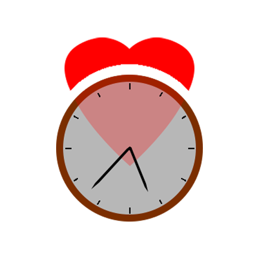
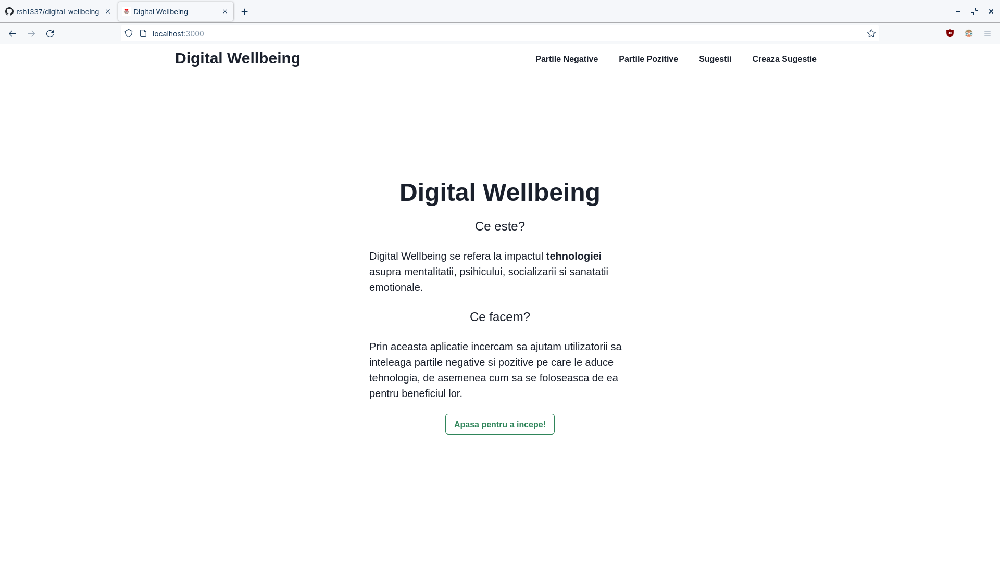
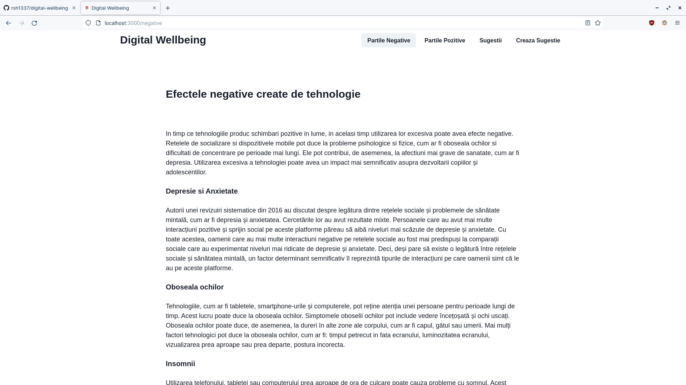
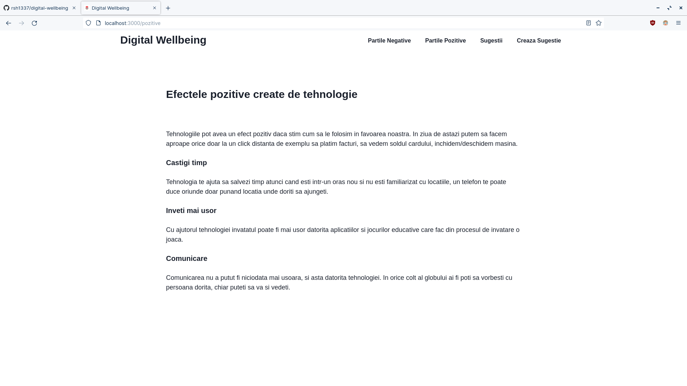
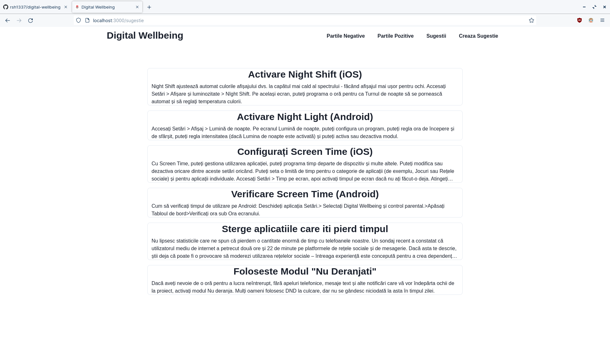
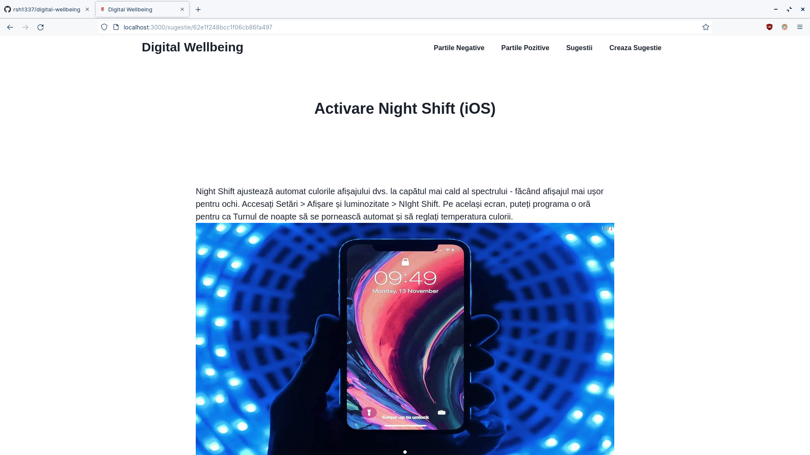
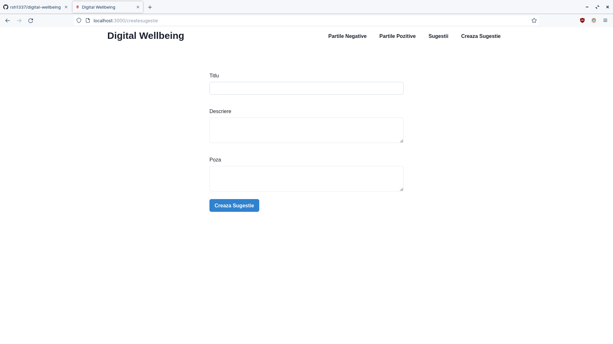
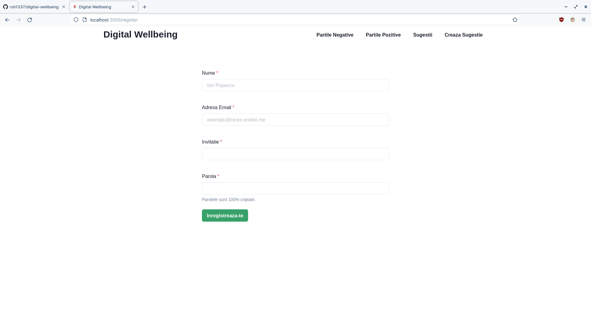
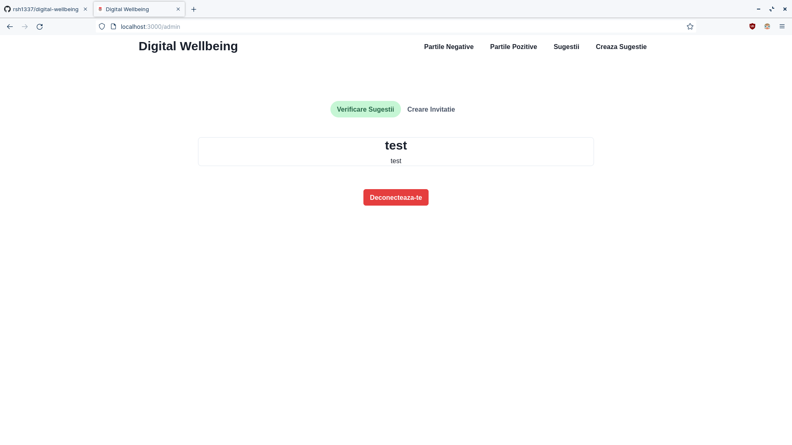

<div align="center">
  <a href="https://github.com/rsh1337/digital-wellbeing">
    
  </a>
    <h3 align="center">Digital Wellbeing</h3>

  <p align="center">
    <br />
    <a href="https://wellbeing.rares-andrei.me"><strong>Incepe Acum<strong><a>
  </p>
</div>

## Despre Proiect



    Digital Wellbeing este un soft educational care are ca scop sa invete lumea cum sa se protejeze pe internet.

### Construit cu

* Libraria de javascript este [React.js](https://reactjs.org/docs/getting-started.html) ajutata de framework-ul [Next.js](https://nextjs.org/docs)
* Libraria de componente se numeste [Chakra-ui](https://chakra-ui.com/getting-started)
* Caruselul pentru poze si videoclipuri a fost creat cu [react-responsive-carousel](https://react-responsive-carousel.js.org)
* Animatiile sunt facute cu [framer-motion](https://www.framer.com/motion/)
* Logo-ul a fost creat de [Cerbu Ionut](https://www.instagram.com/oshikv_/)
* Imaginele sunt incarcate pe [Imgur](https://imgur.com)
* ODM-ul este [Mongoose](https://mongoosejs.com/docs/guide.html) care se foloseste de baza de date [MongoDB](https://www.mongodb.com)
* Pentru autentificarea si inregistrarea adrministratorilor am folosit [Next-Auth](https://next-auth.js.org/getting-started/example)
* Parolele sunt criptate cu ajutorul lui [Bcryptjs](https://www.npmjs.com/package/bcryptjs)
* Sesiunea generata dupa autentificare este realizata cu ajutorul lui [JsonWebToken(JWT)](http://jwt.io)
* Progresiv webapp-ul(PWA) a fost creat cu [next-pwa](https://www.npmjs.com/package/next-pwa)

## Notiuni De Baza

Pentru a rula aplicatia local aveti nevoie de:
* Windows 7 sau mai mare
* Linux
* macOS 10.15 sau mai mare
* [NodeJS](https://nodejs.org) versiunea minima recomandata 16.16.0
* [NPM](https://www.npmjs.com) versiunea minima recomandata 8.x

Pentru a rula aplicatia online aveti nevoie de:
* Conexiune la internet
* iOS 11 sau mai mare
* iPadOS 13 sau mai mare
* macOS 10.15 sau mai mare
* Windows 7 sau mai mare
* Android 5.0 sau mai mare

## Instalare

1. Descarcam Proiectul
```sh
git clone https://github.com/rsh1337/digital-wellbeing
```
2. Instalam Pachetele NPM
```sh
npm install
```
3. Construim Proiectul
```sh
npm run build
```
4. Pornim Proiectul
```sh
npm run start
```

## Prezentare/Utilizare

Accesam https://wellbeing.rares-andrei.me sau http://localhost:3000

### Pagina Principala


Pe pagina principala putem continua navigarea folosind:
1. Bara de navigare
2. Butonul verde

### Partile Negative



Pe pagina "Partile Negative" aduce la cunostinta motivele pentru care unele tehnologii sunt daunatoare pentru om.

### Partile Pozitive



Pe pagina "Partile Pozitive" avem cateva exemple despre cum putem sa folosim tehnologia in favoarea noastra pentru a ne face viata mai usoara.

### Sugestii



In categoria "sugestii" sunt cateva sugestii postate de administratori si comunitate care au ca scop de a ajuta utilizatorii sa descopere mai multe "trucuri" pentru a face mai placuta utilizarea tehnologiei

### Pagina Sugestii



Pe pagina de sugestii se afla o descriere cu un mic tutorial, si una sau mai multe imagini care pot fi folosite in tutorial pentru a fi mai usor de inteles.

### Pagina Creaza Sugestii



Pe pagina creaza sugestii putem trimite o sugestie catre administratori, si daca acea sugestie este buna, va fi acceptata si ulterior facuta publica.

### Pagina De Register



Pe pagina de register putem crea un cont de administrator folosind o invitatie generata de alt administrator

### Pagina de inregistrare a administratorilor



Pe pagina de administratori putem sa acceptam/edita/sterge sugestiile trimise de comunitate si putem crea invitatii pentru alti administratori